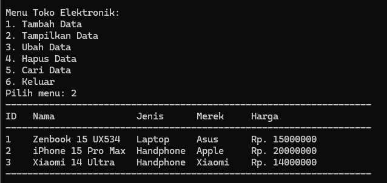

## Janji
_Saya Nurul Atiqah dengan NIM 2406279 mengerjakan soal Tugas Praktikum 1 "OOP dan Enkapsulasi" dalam mata kuliah Desain Pemrograman Berbasis Objek untuk keberkahanNya maka saya tidak melakukan kecurangan seperti yang telah dispesifikasikan. Aamiin._

## Desain Class

Class tunggal bernama BarangElektronik (atau varian serupa di setiap bahasa) untuk merepresentasikan setiap item barang. Class ini memiliki minimal empat atribut privat yang mencakup informasi penting tentang barang:
- **ID**: Identifier unik untuk setiap barang. (auto increment, dan tidak bisa diubah)
  
- **Nama**: Nama barang elektronik.
  
- **Jenis**: Kategori barang (misalnya: laptop, handphone, televisi).
  
- **Merek**: Merek atau produsen barang.
  
- **Harga**: Harga barang.
  
- **Gambar** (Khusus PHP): Path file lokal untuk gambar produk.

Setiap class dilengkapi dengan constructor untuk inisialisasi objek, serta metode getter dan setter publik. Metode getter berfungsi untuk mengambil nilai atribut, sedangkan setter digunakan untuk mengubahnya. Pendekatan ini memastikan enkapsulasi data, di mana akses ke atribut hanya bisa dilakukan melalui metode yang telah ditentukan.

## Sistem Pemrosesan Input dan Alur Kode

Alur program secara umum mengikuti pola Create, Read, Update, Delete, Search (CRUD-S) dan diimplementasikan dalam sebuah loop menu interaktif.

### 1. Struktur Data: 
  Program menggunakan koleksi objek (vector di C++, ArrayList di Java, list di Python, dan $_SESSION di PHP) untuk menyimpan dan mengelola semua objek BarangElektronik.

### 2. Pemrosesan Input:

- **Versi CLI** (C++, Java, Python): Input diambil dari terminal menggunakan cin, Scanner, atau input(). Program akan menampilkan menu pilihan dan memproses input pengguna melalui struktur switch-case atau if-elif-else.
  
- **Versi Web** (PHP): Input dikelola melalui formulir HTML. Data dari formulir dikirim ke server melalui metode POST atau GET. Logika PHP di server akan membaca data dari variabel $_POST atau $_GET untuk memproses operasi yang diminta.

### 3. Alur Kerja:

- **Tambah Data:** Pengguna memasukkan detail barang. Program membuat objek BarangElektronik baru dengan ID unik dan menambahkannya ke dalam koleksi.
    
- **Tampilkan Data:** Program melakukan iterasi pada seluruh koleksi objek dan mencetak setiap atributnya dalam format yang rapi (misalnya, tabel).
    
- **Ubah Data:** Pengguna memasukkan ID barang yang ingin diubah. Program mencari objek dengan ID tersebut. Jika ditemukan, program meminta input data baru dan memperbarui atribut objek.
    
- **Hapus Data:** Pengguna memasukkan ID barang. Program mencari objek yang cocok dan menghapusnya dari koleksi.
    
- **Cari Data:** Pengguna memasukkan ID, dan program akan mencari serta menampilkan detail dari satu objek spesifik tersebut.

## Dokumentasi

### C++

| Tambah Data | Tampilkan Data | Cari Data |
|-------------|----------------|-----------|
|  |  |  |

| Edit Data | Hapus Data |
|-----------|------------|
|  |  |

---

### Python

| Tambah Data | Tampilkan Data | Cari Data |
|-------------|----------------|-----------|
|  |  |  |

| Edit Data | Hapus Data |
|-----------|------------|
|  |  |

---

### Java

| Tambah Data | Tampilkan Data | Cari Data |
|-------------|----------------|-----------|
|  |  |  |

| Edit Data | Hapus Data |
|-----------|------------|
|  |  |

---

### PHP

| Tambah Data | Tampilkan Data | Cari Data |
|-------------|----------------|-----------|
|  |  |  |

**Edit Data**  

  
  
  

**Hapus Data**  

  
  

---
